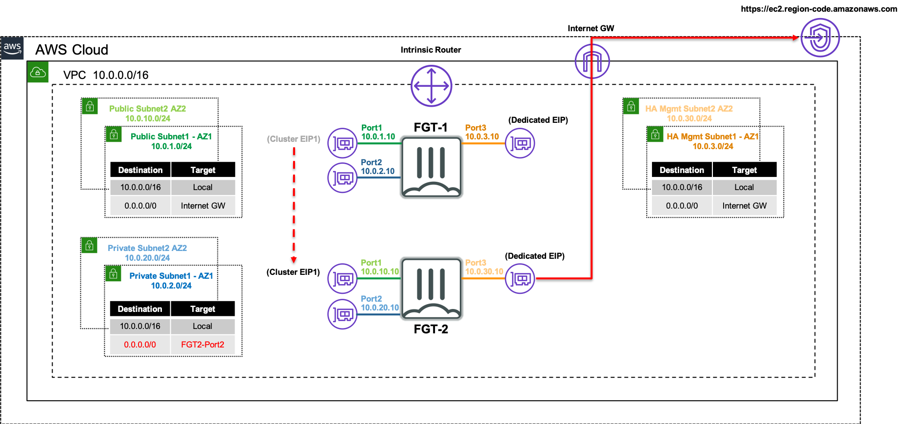
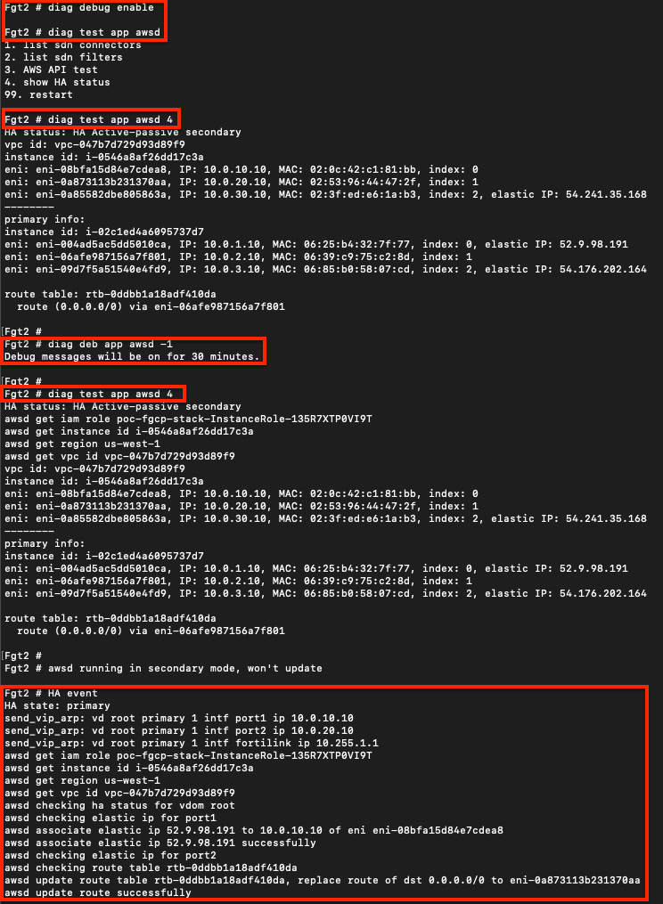

The following network diagram will be used to illustrate a failover event from the current master FortiGate (FortiGate 1), to the current slave FortiGate (FortiGate 2).

Inbound failover is provided by reassigning the EIPs associated to the primary IP address of ENI0\port1 from FortiGate 1's public interface to FortiGate 2's public interface.

Outbound failover is provided updating any route targets referencing FortiGate 1’s private interface reference FortiGate 2’s private interface.

The AWS SDN updates are performed by FortiGate 2 initiating API calls from the dedicated HA management interface (ie ENI2\port3) through the AWS Internet Gateway.

{}
To validate that the FortiGates can assume at least read only permissions about themselves, you can use the commands below on either the master or slave.  This will send requests to the instance metadata service and EC2 api.

```
diag debug enable
diag test app awsd 4
```

To enable more verbose debugging output with the test command above or for an actual HA failover event, use the commands below.
```
diag debug enable
diag debug app awsd -1
```

To disable and reset the debugging levels, use the commands below.
```
diag debug reset
diag debug disable
```
{}




Here is an example of running test and debug commands before a failover event to get more verbose output.  Notice the EIP and VPC route replacements to reference the new master FortiGate 2.

