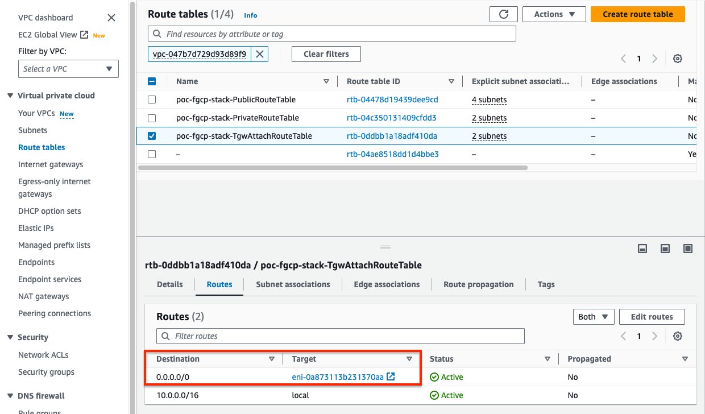
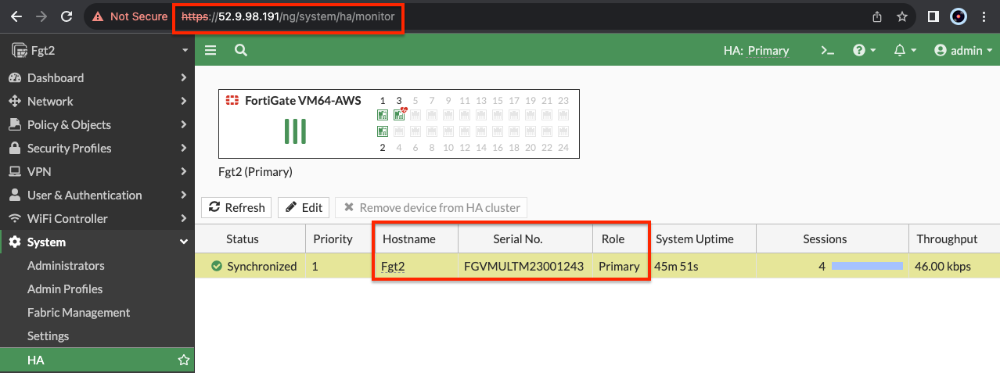

{}
This is picking up after a successful deployment of FGCP with CloudFormation.  The same steps can be used, post deployment, to validate a successful setup and test failover.
{}

1.  When using CloudFormation, your stack will have outputs you can use to login to the FortiGates via the cluster or dedicated EIPs.  If you used Terraform, these outputs will be listed in your terminal session.


2.  Using the login information in the stack outputs, login to the master FortiGate instance with the ClusterLoginURL.  This should put you on FortiGate 1.  You will also be prompted to change the initial password for the admin account.


3.  Navigate to the HA status page on the master FortiGate by going to System > HA.  Now you should see both FortiGate 1 and FortiGate 2 in the cluster with FortiGate 2 as the current slave.


4.  Give the HA cluster time to finish synchronizing their configuration and update files.  You can confirm that both the master and slave FortiGates are in sync by looking at the Status column and confirming there is a green check next to both FortiGates and the status is Synchronized.

*** **Note:** Due to browser caching issues, the icon for Synchronization status may not update properly after the cluster is in-sync.  So either close your browser and log back into the cluster or alternatively verify the HA config sync status with the CLI command ‘get system ha status’. ***

	


{}
While waiting for FGCP to synchronize, you can check that the licensing (BYOL in this example) is applied successfully and the base config is applied correctly.  You can run the command below on each FortiGate to validate this:

```
diag debug cloudinit show
```
{}


5.  Navigate to the AWS EC2 console and reference the instance Detail tab for FortiGate 1.  Notice the primary IPs assigned to the instance ENIs as well as the 2 EIPs associated to the instance, the Cluster EIP and the HAmgmt EIP.


6.  Now reference the instance Detail tab for FortiGate 2.  Notice the primary IPs assigned to the instance ENIs and only one EIP is the HAmgmt EIP.


7.  Navigate to the AWS VPC console notice the default route in the VPC route table with a next hop targeting ENI1\port2 of FortiGate 1 which is the current master.  This VPC route table is applied to the TGW attach subnets to direct traffic from Transit Gateway to the current master FortiGate private interface.

{}
Since we use the 'NewSecurityVPC_FGCP_DualAZ.template.json' CloudFormation template, a default route was created for us in the appropriate VPC route table.  If using the existing VPC templates for either CloudFormation or Terraform, you will need to create the appropriate routes yourself.
{}


8.  Navigate back to the AWS EC2 console and reference the instance Detail tab for FortiGate 1.  Now shutdown FortiGate 1 via the EC2 console and refresh the page after a few seconds.  Notice that the Cluster EIP is no longer assigned to FortiGate 1.


9.  Now reference the instance Detail tab for FortiGate 2.  Notice that the Cluster EIP is now associated to FortiGate 2.


10.  Navigate back to the AWS VPC console and look at the routes for the default route table.  The default route target is now pointing to ENI1\port2 of FortiGate 2.



11.  Now log back into the cluster_login_url and you will be placed on the current master FortiGate, which should now be FortiGate 2.



12.  Now power on FortiGate 1 and confirm that it joins the cluster successfully as the slave and FortiGate 2 continues to be the master FortiGate.


{}
If you enabled debugging output on FortiGate 2 before the failover event, you would see debug output which shows what is happening under the covers.
{}


13.  This concludes the post deployment example.