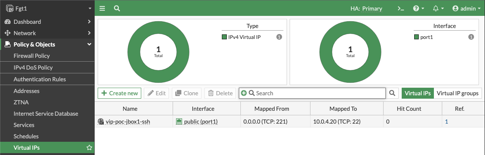

### Working with VIPs

Below, we have listed two common scenarios with VIPs and also have a caveats section for consideration.


### VIP to EC2 Instance (SSH)
- 1. Log into your AWS account and take note of the private IP of the EC2 instance you want to expose through the FGCP Cluster EIP.  Notice that this instance does not have any EIP assigned to it directly, only a single private IP.


- 2. Log into the master FortiGate with the ClusterLoginURL and navigate to Policy & Objects > Virtual IPs and click **Create New**.  Give the VIP a name, set the interface to **port1**, leave type as **Static NAT**, leave External IP as **0.0.0.0**, specify the private IP of the instance in **Map to IPv4 Address**, and in the port forwarding section set the protocol, port, and external/map ports as shown and click **OK**.




- 3. Navigate to Policy & Objects > Firewall Policy and click **Create New** to create an inbound policy to use the VIP as a destination object.  Notice we are using a geography based address object to restrict the source to IPs within the United States.  We also are **disabling source NAT** so the instance can see the original source IP.

{}
Since we are disabling source NAT, there are a few points to consider in your environment:

- Service Objects:  Since the VIP is configured with port forwarding, it matches based on the configured 'mapped to' protocol and destination port.  The service object in the FW policy should be configured to with the exact same 'mapped to' values or else traffic will not match the VIP and FW Policy as expected.

- Security Groups:  Make sure your security group applied to the FGT port1 allows the port used in the external service port of the VIP.  Also your security group applied to your EC2 instance will need to allow the mapped to port and also a source IP range of '0.0.0.0/0' or whatever CIDR blocks cover your needs.  Since the FGT is applying inspection we are fine to leave this as '0.0.0.0/0' for now.

- VPC routes:  If your EC2 instance is deployed in the same VPC as the FortiGates, the subnet needs to have a VPC route table assigned with a VPC route of '0.0.0.0/0' back to the master FGT port2 ENI.  If your EC2 instance is in a different VPC connected via Transit Gateway, then you need VPC routes pointing traffic back to Transit Gateway, and Transit Gateway route tables configured to get traffic back to the security VPC where the FortiGates are.

- Troubleshoot:  If traffic is not flowing as expected, it is recommended to run a packet capture to validate inbound traffic is making it past the security groups, the traffic is accepted and routed out port2, and return traffic is received.  If the traffic does not show in the packet capture, then it is likely a security group or something else external that is blocking the traffic.  A quick example of a sniffer we could use for this VIP is **diag sniffer packet any "(port 221) or (host 10.0.4.20 and port 22)" 4 0 l**.  For more examples on how to use the sniffer and other tools, reference [documentation](https://community.fortinet.com/t5/FortiGate/Troubleshooting-Tip-First-steps-to-troubleshoot-connectivity/ta-p/192560).
{}


- 4. Now we can test SSHing to the EC2 instance with the VIP and FW policy in place.  Notice in this example that an SSH key is being used, the external port of 221 is being used, and when I do a 'what's my ip check' the instance gets the Cluster EIP.  Here is a run of the packet capture as well.


### VIP to Internal ALB (HTTP)

- 1. Now we will show how to send HTTP traffic to an internal Application Load Balancer (same steps work for NLB or ELB Classic).  As the load balancer can scale in or out on demand, AWS recommends using FQDN to reach the internal ALB with the latest resolved IP.  To get started, we will need to gather the DNS A record for the internal ALB to configure a FQDN based VIP.

{}
Even though this is an internal or private load balancer, the DNS A record is a public record which will resolve to the current private IPs of your ALB.

```
haberra@haberra-mac kpair % nslookup internal-poc-internal-hafc1-1204713825.us-west-1.elb.amazonaws.com
Server:		172.30.1.106
Address:	172.30.1.106#53

Non-authoritative answer:
Name:	internal-poc-internal-hafc1-1204713825.us-west-1.elb.amazonaws.com
Address: 10.0.40.106
```
{}


- 2. Log into the master FortiGate with the ClusterLoginURL and navigate to Policy & Objects > Address and click **Create New**.  Give the address a name, set the type to **FQDN**, leave interface to any, provide the DNS A record for the internal ALB, and click **OK**.  Once the DNS entry has been resolved, if you hover over your address object, you get the resolved IP for the moment.


- 3. Navigate to Policy & Objects > Virtual IPs and click **Create New**.  Give the VIP a name, set the interface to **port1**, set the type to **FWDN**, leave External IP as **0.0.0.0**, select the FQDN address object created in the last step for **Mapped Address**, and in the port forwarding section set the protocol, port, and external/map ports as shown and click **OK**.


- 4. Navigate to Policy & Objects > Firewall Policy and click **Create New** to create an inbound policy to use the VIP as a destination object.  Notice we are using a geography based address object to restrict the source to IPs within the United States.  We also are **disabling source NAT** so the internal ALB can see the original source IP and add this to the HTTP headers for X-Forwarded-For.


- 5. Now we can test opening up a browser to the Cluster IP using HTTP to reach the web servers being served by the internal ALB.


### VIP Caveats

- 1. In the two example VIPs above, we left the external ip to '0.0.0.0' since we specified 'port1' for the interface.  Any traffic destined to a private IP assigned to port1, that matches the protocol, and external service port will match those VIPs.  You still have FW policy applying source/service/schedule checks and L7 inspection with NGFW. 

{}
You can set the external ip to the matching private IP which is associated to the Cluster IP but this comes with points to consider.  

- You need to disable syncing all VIPs since the FortiGates are deployed in different Availability Zones, they are in separate subnets and can’t share or sync their physical interface IPs or VIP external IPs (when used).  This means you need to configure the VIPs on both FGTs, with the same name etc but different external ip, and then configure FW policy so that all other synced items can be shared.

- If FortiManager is used, it can manage these FortiGates while not syncing policy objects but requires additional steps.  Reference [documentation](https://community.fortinet.com/t5/FortiManager/Technical-Tip-FortiManager-manages-FortiGate-HA-in-AWS-Azure/ta-p/260388) for more information.
{}

- 2. You can configure multiple Cluster IPs and map this to multiple secondary IPs on the AWS ENI (ie network interface) and FortiGate port1 config.  However, failover and AWS SDN updates take longer when you have more API calls to make for each additional mapped EIP and secondary IP.  Generally, if you are using less then 5 EIPs this is ok.  If you need to support many web applications and other non-HTTP traffic, it is recommended to use external Application or Network Load Balancers (ALB or NLB).  Reference this [use case](72_usecase2.html) in more detail.
