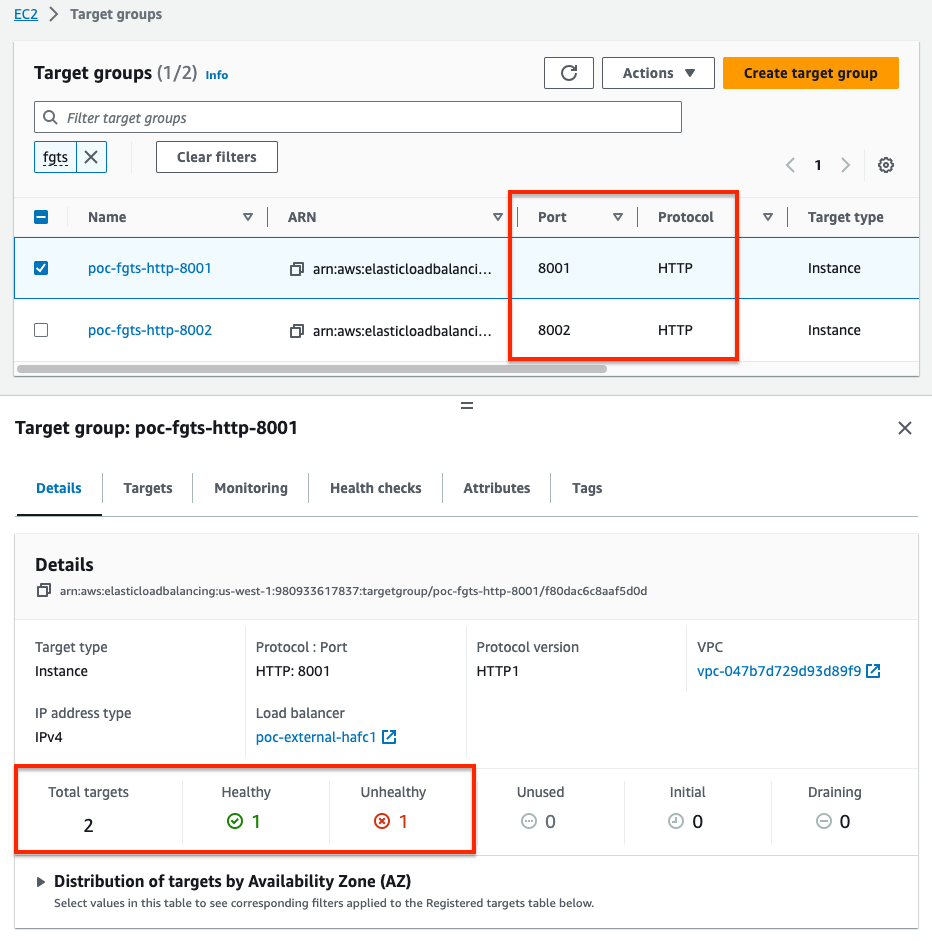
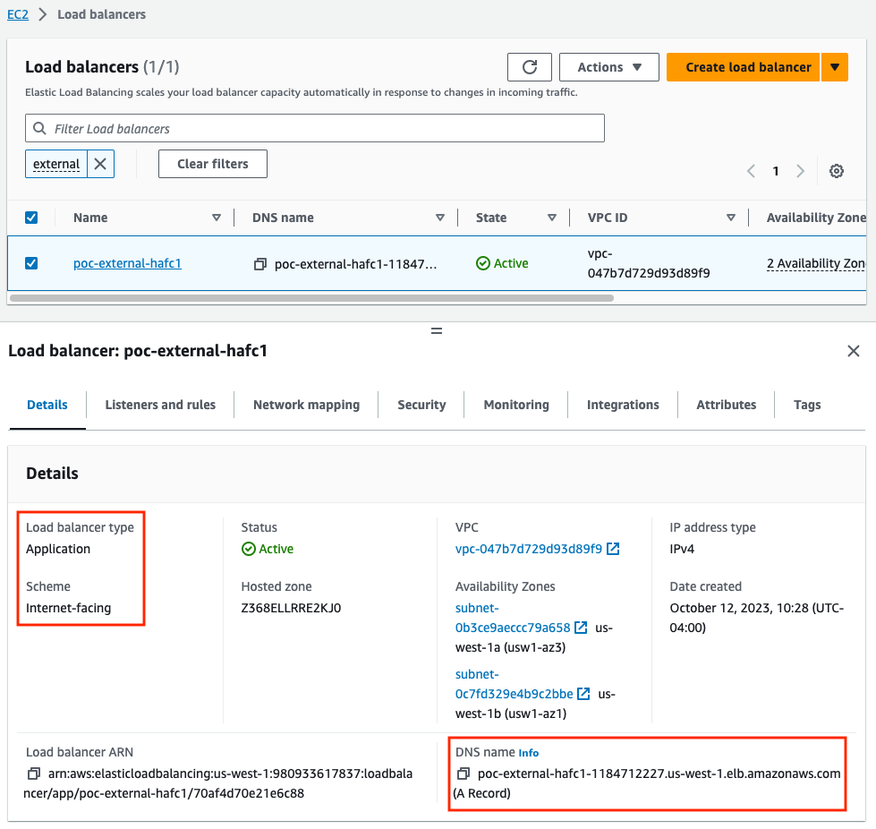
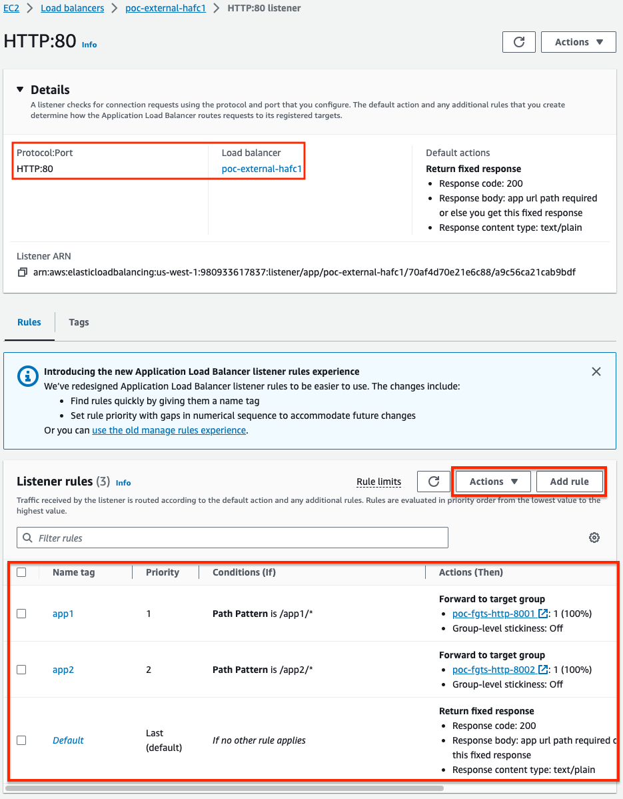
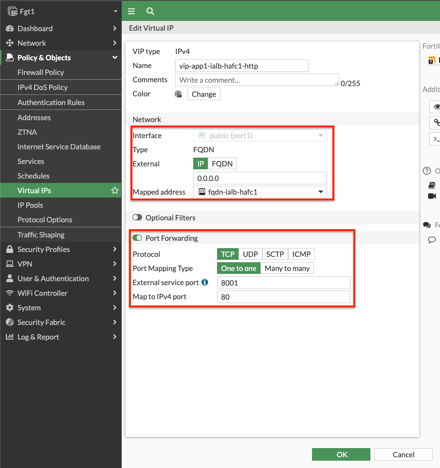
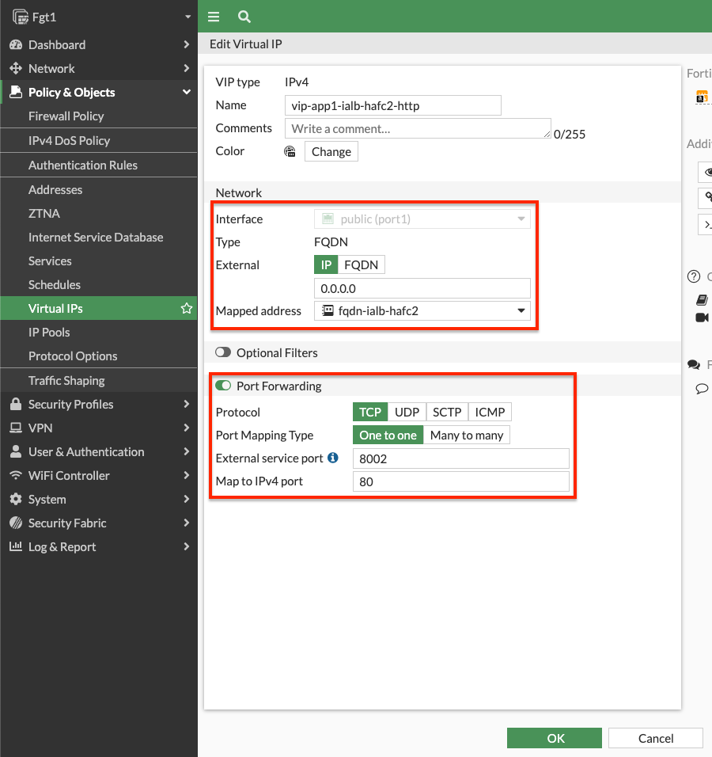
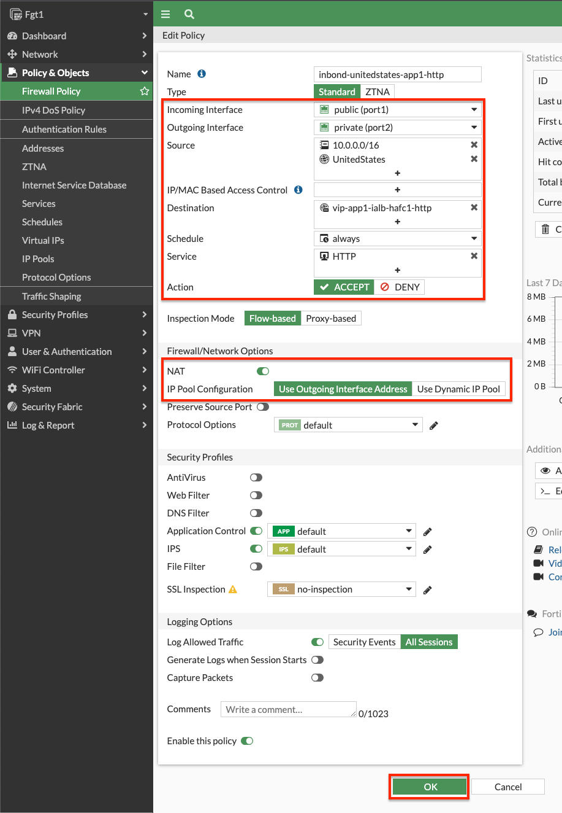
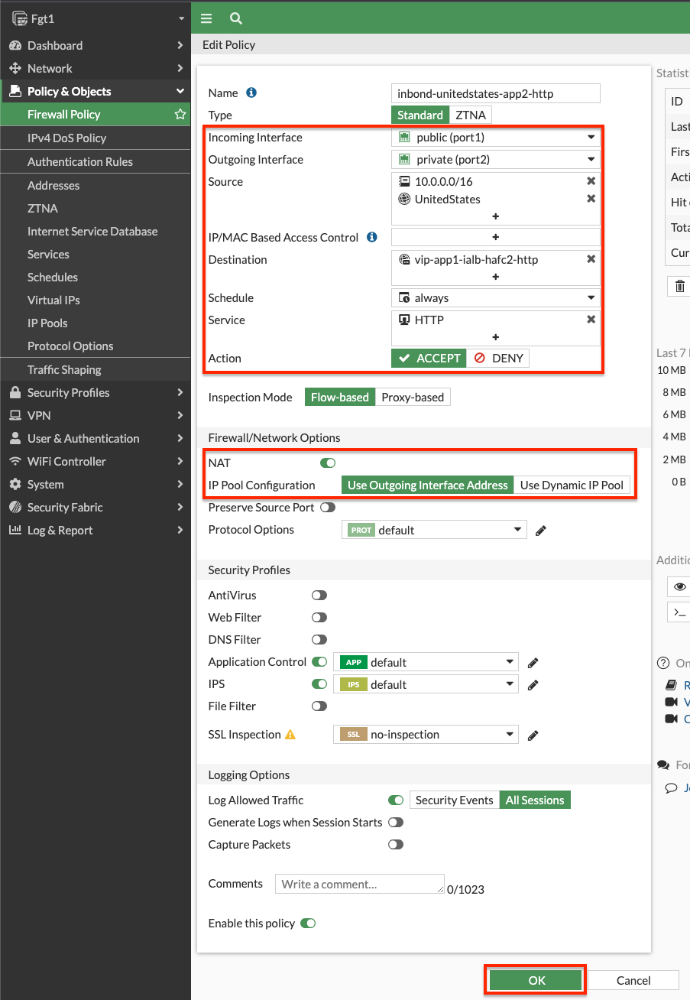
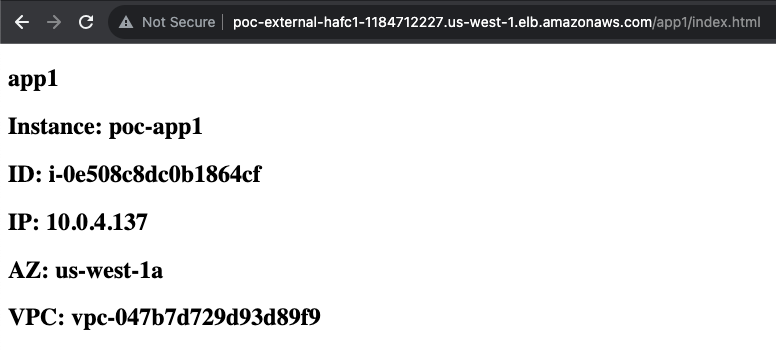
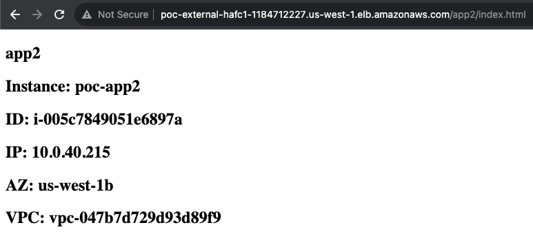
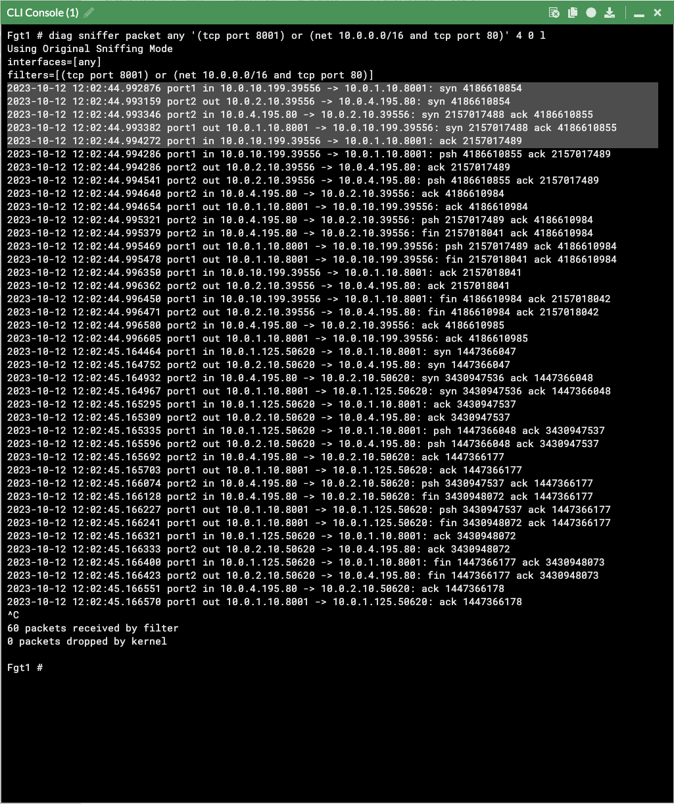

### Supporting multiple web applications (over HTTP/HTTPS)

When you need to support multiple web applications that each have unique destinations, it is recommended to use an external Application Load Balancer (ALB) with HTTP based routing rules in front of the FortiGates to break out each application to a unique destination port.  This allows each application to match a unique FW policy and VIP for applying the desired L4 and L7 controls to each web application.  Also a point to note is the client browser will still be accessing these applications on the standard ports for HTTP/HTTPs.  Each ALB listener can support up to 300 HTTP based routing rules so this scales and fails over faster than you could do with multiple Cluster IPs.


- 1. Log into your AWS account and create a target group for each web application that has a unique destination.  In our example, we have two web apps so we created two target groups, one with HTTP port 8001 and the other with HTTP port 8002.  Each target group is pointing to both of the FortiGate port1 interfaces.  Since these FGTs are A/P, only the master FGT will show as healthy.



- 2. In the EC2 console create an external ALB in the same public subnets the FortiGate port1 interfaces are deployed in.  Make sure that the scheme is **internet-facing**, the **security group allows inbound HTTP/HTTPS from the relevant CIDR blocks**, and that the listener is using either HTTP (port 80) or HTTPS (port 443).  For listener default action, select any HTTP target group for now, we will change this in the next step.



- 3. In the EC2 console, select your external ALB and navigate to the **Listeners and Rules** tab, select the listener (either HTTP:80 or HTTPS:443), click **Manage Rules**, then **Add Rules**.  This will take you to a details page for the listener.  Then you can add/edit rules based on HTTP conditions (host, path, etc) to then forward traffic to the different target groups created in step 1 above.  In our example, we have the two web apps going to their target groups based on HTTP path being either /app1/* or /app2/* and updated the default rule to just send a fixed content message.  In a production environment, it is recommended to use HTTP Host to match your application HTTP Hostname ie app1.mycorp.com, app2.mycorp.com, etc.



- 4. Log into the master FortiGate with the ClusterLoginURL and create the VIPs to accept traffic on port1, has a external service port of 8001, and a map to IPv4 port of 80.  Do the same again but use an external service port of 8002 and going to the mapped IP/FQDN for app2.  In our example we are using FQDN base VIPs since our backend application is a fleet of EC2 instances behind a private ALBs.  To configure this for either an FQDN or a standard Static NAT VIP, check out the use case on [VIPs](71_usecase1.html).





- 5. Navigate to Policy & Objects > Firewall Policy and create two inbound policies to use the VIPs as a destination objects.  Notice we are using a geography based address object to restrict the source to IPs within the United States.  We also are **enabling source NAT to keep return traffic coming back to the master FortiGate and not the external ALB first**.  Also **notice we are allowing 10.0.0.0/16 as a source to allow the external ALB health checks** to match the VIPs and send their traffic to the backend target of the VIPs.  





- 6. Now we can test accessing both applications with the DNS name of the external ALB and using a HTTP path to match the listener rules.  In our example we are using the URLs below and can capture the traffic flow using these sniffers.

```
http://poc-external-hafc1-1184712227.us-west-1.elb.amazonaws.com/app1/index.html
http://poc-external-hafc1-1184712227.us-west-1.elb.amazonaws.com/app2/index.html
```

```
diag sniffer packet any '(tcp port 8001) or (net 10.0.0.0/16 and tcp port 80)' 4 0 l
diag sniffer packet any '(tcp port 8002) or (net 10.0.0.0/16 and tcp port 80)' 4 0 l
```

{}
While our simple lab example has all resources in the same VPC, you can use the same design to reach web applications in different VPCs that are reachable through Transit Gateway or other AWS networking components.
{}







- 7.  This concludes this section.
