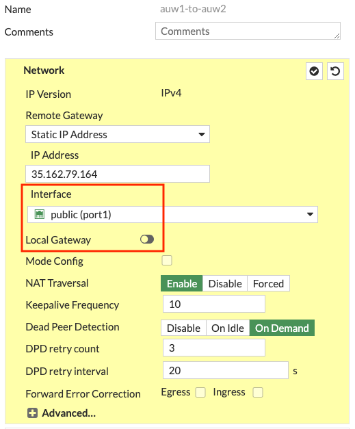
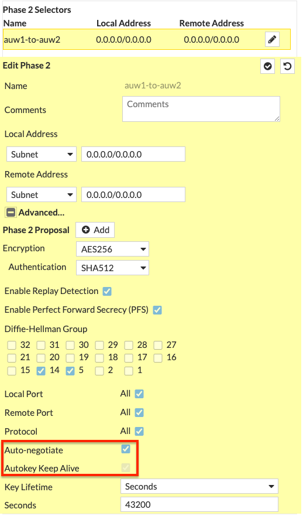
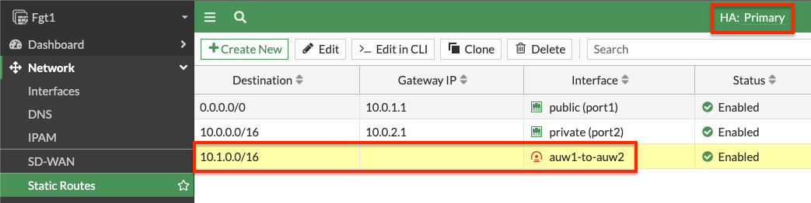
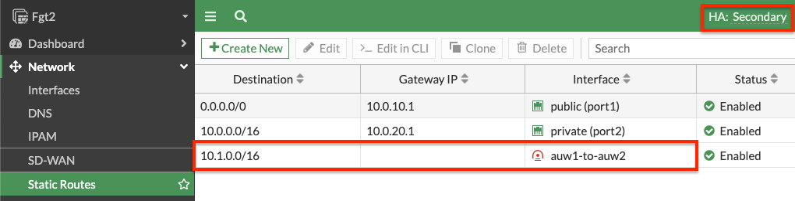
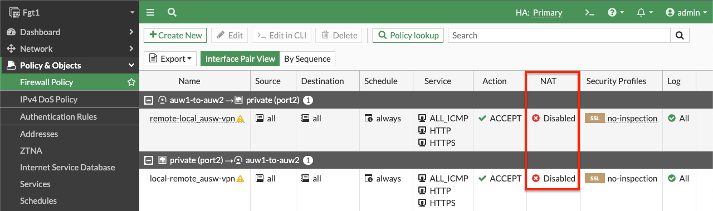
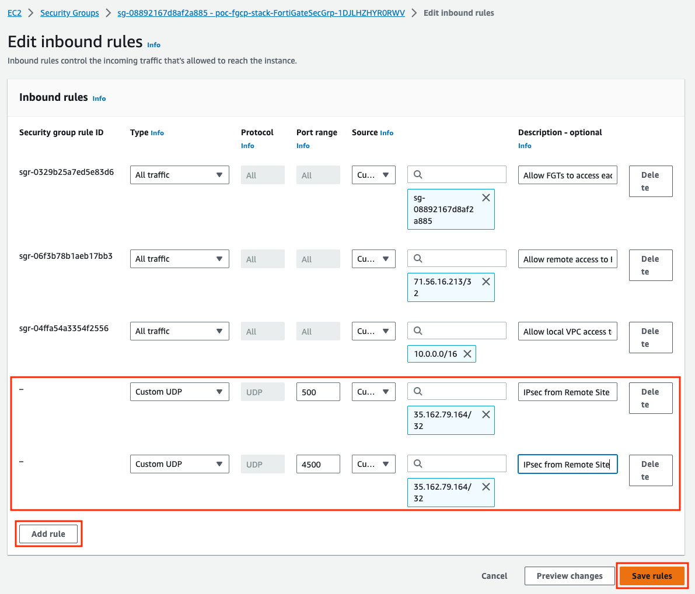
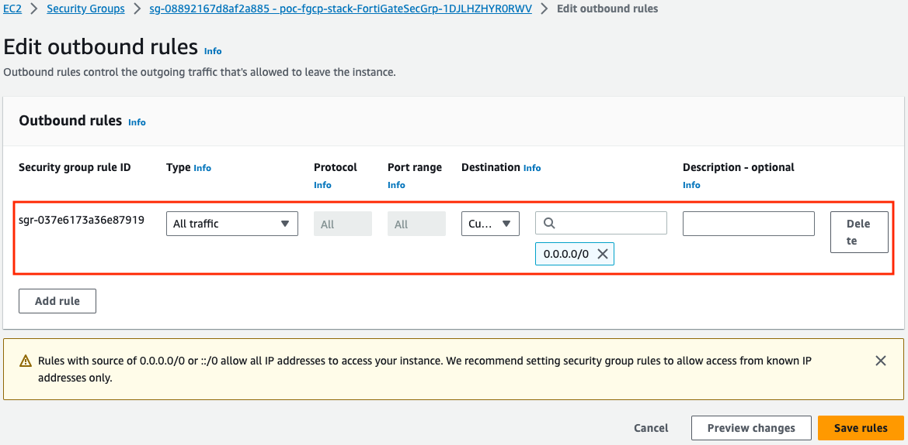
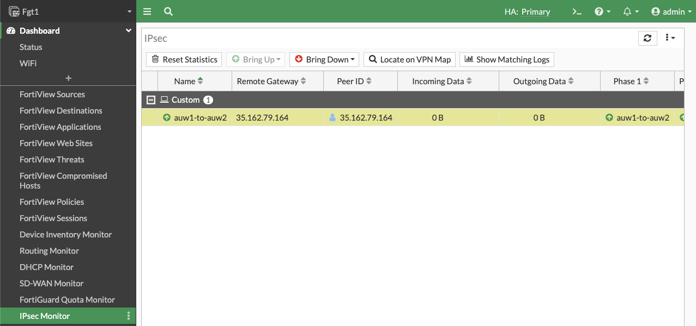
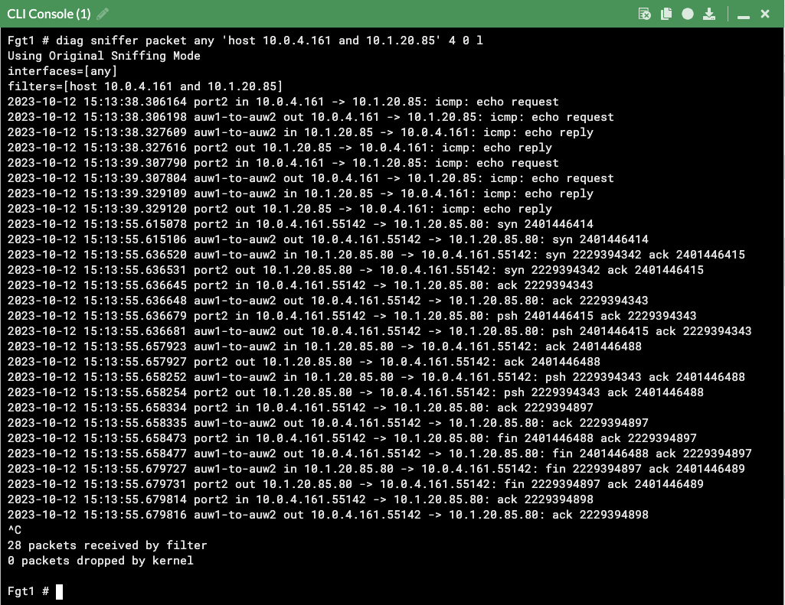
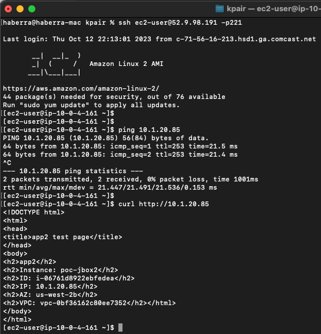

When FGCP is deployed using the IaC templates, located [here,](73_usecase3.html) you already have a single Cluster IP associated to port1 on the master FortiGate.  On failover, this Cluster IP is reassociated to port1 on the new master FortiGate.  This makes IPsec VPN failover simple for remote devices connecting to a FGCP A/P cluster in AWS.  Below is an example of this use case.

{}
While the design is quite simple, there are a few points to consider:

- Security Groups:  Since these are applied to the FortiGate interfaces, make sure that UDP port 500 & 4500 are allowed for both inbound and outbound rules on port1 of the FortiGates.  Also make sure security groups that are applied to port2 of the FortiGates and other relevant resources are allowing communication with the remote network CIDRs.

- Elastic IPs (EIP):  This is a public IP that can be associated to resources such as EC2 instances and even specific private IPs on an elastic network interfaces (ENIs ie port1).  This EIP is used as a static NAT when traffic traverses the Internet Gateway (IGW) of the VPC.  This means the FortiGate does not have this public IP directly assigned via DHCP to the port1 interface.  Instead port1 will have a private IP, but as traffic is initiated outbound, the IGW will SNAT the traffic to match the associated EIP.  The same happens in reverse for inbound traffic.

- Local Gateway:  In your FortiOS phase 1 configuration, **don't enable 'Local Gateway'**.  This is only needed when configuring the FortiGate to use a secondary IP which is associated to an additional EIP (ie Cluster IP #2).  When using an FGCP cluster deployed in separate Availability Zones (AZ), this requires disabling the syncing of phase 1 config by adding 'vpn.ipsec.phase1-interface' to your [config system vdom-exception](https://docs.fortinet.com/document/fortigate/7.4.0/administration-guide/105611/vdom-exceptions) table.  This should only be used for this [use case](https://fortinetcloudcse.github.io/FGCP-in-AWS/7_usecases/74_usecase4.html) as there is added complexity to consider.

- VPC routing:  A VPC route is needed in the VPC route table assigned to the private subnets that need to reach the remote networks over the IPsec tunnel.  This VPC route(s) should cover all of the remote network CIDRs and point to port2 (ENI1) of the master FortiGate.

- FortiOS static routes:  Remember that static routes will need to be **configured on both FortiGates** as they are not synced when deployed in separate subnets (AZs) in AWS.

- FortiOS dynamic routing:  While FortiGates deployed in separate subnets (AZs) do not sync interface config, you can create a loopback interface with the same name and IP on both FortiGates.  This can allow for simple dynamic routing with BGP/OSPF while syncing this config automatically between FortiGates.

- Phase 2:  It is recommended to enable 'Auto-negotiate' and 'Autokey Keep Alive' in phase 2 advanced settings to keep phase 2 established at all times.
{}


- 1.  Log into the master FortiGate with the ClusterLoginURL and configure your VPN.  In this example we chose to use a 'custom' template type in the wizard.  Notice we selected port1 for the interface and left 'Local Gateway' disabled for phase 1.  For phase 2, we enabled 'Auto-negotiate' and 'Autokey Keep Alive'.





- 2.  On **both FortiGates** we create static routes referencing the remote networks.  You can log into the secondary FortiGate with the direct FortiGate2LoginURL or FortiGate2LoginURL which are the dedicated EIPs associated to the hamgmt interfaces, ie port3, of the FortiGates.





- 3.  On the master FortiGate, create FW policies to allow traffic as needed.  **Note you need to disable source NAT**.



- 4. At this point the IPsec tunnel is down because we need to allow UDP 500 and 4500 inbound.  Here are the inbound and outbound rules of the security group assigned to port1 of the master FortiGate.





- 5.  Now our tunnel is up and we can send traffic from hosts behind both the local and remote FortiGates.  We can validate traffic flow with packet captures, FW policy logs, etc.

```
diag sniffer packet any 'host 10.0.4.161 and 10.1.20.85' 4 0 l
```







- 6.  This concludes this section.
