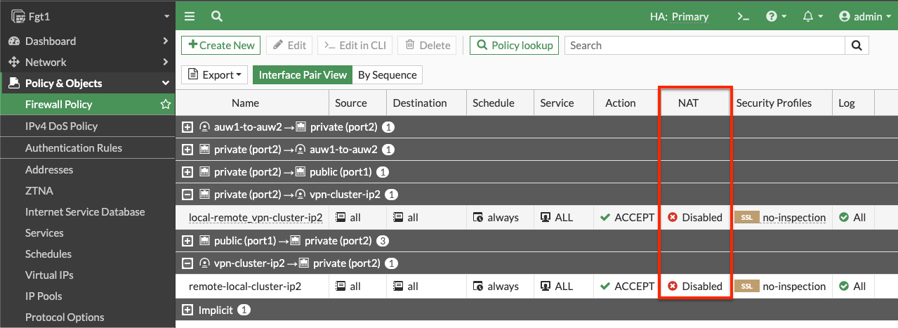

It is recommended to review the [IPsec VPN: One Custer IP use case](73_usecase3.html) first before using this use case.

FGCP supports moving multiple Elastic IPs (EIPs) on data plane interfaces, which allows the cluster to have multiple Cluster IPs.  This is useful when needing to support IPsec tunnels being establish with different Cluster IPs.  Below is an example of how to configure this.

{}
Here are a few points to consider:

- Secondary IPs:  This deign requires the use of secondary private IPs on the AWS Elastic Network Interface (ENI, ie port1) and within FortiOS.  Then different EIPs can be associated to each of these on the master FortiGate port1 interface.

- Same Count:  You should configure the same number of secondary private IPs on both FortiGates within FortiOS and within the AWS ENI settings.

- Failover Latency:  This design should use as few EIPs as necessary as failover times will increase.  This is due to more API calls needing to be made and also waiting for AWS SDN (AWS networking) to implement these changes.  As there is no SLA on how quickly these changes are implemented in AWS SDN, you will see some EIPs take quite a bit longer to failover.  It is best practice to limit this to no more than 5 EIPs.

- Local Gateway:  FortiOS requires the use of the 'Local Gateway' phase 1 setting to know which secondary IP to use for an IPsec tunnel.  Each FortiGate will have different secondary IPs as they are in different subnets & AZs.  This requires disabling the syncing of phase 1 & 2 config between the FortiGates by adding **vpn.ipsec.phase2-interface** and **vpn.ipsec.phase2-interface** to your [config system vdom-exception](https://docs.fortinet.com/document/fortigate/7.4.0/administration-guide/105611/vdom-exceptions) table.
{}

- 1.  For both the master and slave FortiGates we will configure secondary IPs on the port1 (ENI0) interface.  In the EC2 Console, right click the FortiGate and navigate to Networking > Manage IP addresses, then expand the eth0/port1 section, click Assign new IP address, provide the additional private IP and click save.  **Do this for both FortiGates**.

- 2.  In the EC2 Console, navigate to Network & Security > Elastic IPs and click **Allocate Elastic IP address**.  On the next page click **Allocate**. On the following page click **Associate this Elastic IP address**.  On the next page, select **Network interface** as the resource type, then search for **fgt1eni0** and select the ENI of the master FortiGate for your deployment.  Then select the secondary private IP address you assigned to the ENI and click **Associate**.  **Only do this for the master FortiGate**.

- 3.  On **both FortiGates** we configure secondary IPs that match what is configured in the EC2 console.  You can log into the secondary FortiGate with the direct FortiGate2LoginURL or FortiGate2LoginURL which are the dedicated EIPs associated to the hamgmt interfaces, ie port3, of the FortiGates.

- 4.  On the master FortiGate with the ClusterLoginURL and **disable syncing the phase 1 & 2 tables between FortiGates**.  This is done by adding **vpn.ipsec.phase2-interface** and **vpn.ipsec.phase2-interface** to your config system vdom-exception table in the CLI.

- 5. On **both FortiGates** we configure our VPN with the use of the **Local Gateway** setting. In this example we chose to use a 'custom' template type in the wizard.  Notice we selected port1 for the interface and set 'Local Gateway' to each FortiGate's secondary IP for port1.  For phase 2, we enabled 'Auto-negotiate' and 'Autokey Keep Alive'. 

{}
As syncing of phase 1 & 2 is now disabled, you should be careful to name both phase 1 & 2 with the same name so that FW policy configured on the master will sync to FortiGate 2.
{}

- 6.  On **both FortiGates** we create static routes referencing the remote networks.  You can log into the secondary FortiGate with the direct FortiGate2LoginURL or FortiGate2LoginURL which are the dedicated EIPs associated to the hamgmt interfaces, ie port3, of the FortiGates.

- 7.  On the master FortiGate, create FW policies to allow traffic as needed.  **Note you need to disable source NAT**.

- 8.  Now our tunnel is up and we can send traffic from hosts behind both the local and remote FortiGates.  We can also test and enable debugging of the awsd process to see the additional Cluster IP be moved as part of the failover and VPN is established on the new master FortiGate.  Make sure to run the debugging on the secondary FortiGate before it becomes the new master.

- 9.  This concludes this section.
