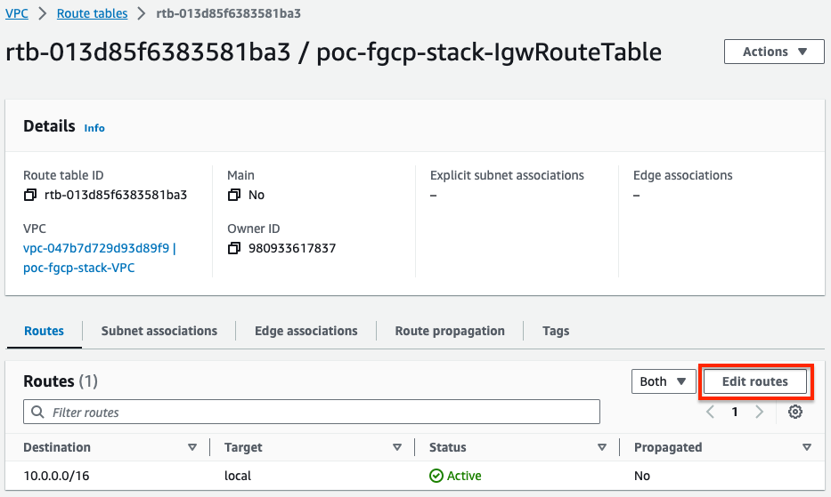
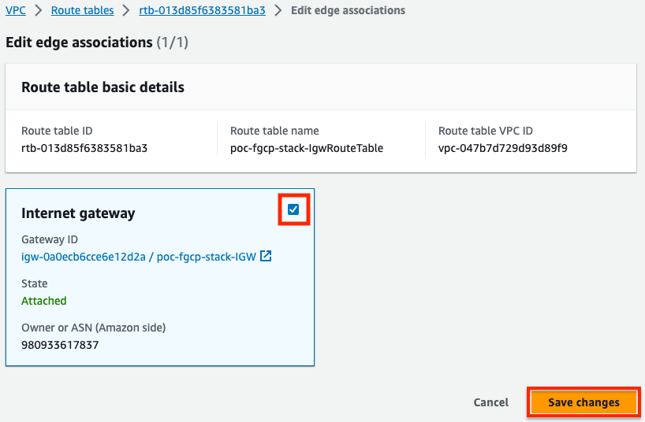

AWS introduced [VPC Ingress Routing](https://aws.amazon.com/blogs/aws/new-vpc-ingress-routing-simplifying-integration-of-third-party-appliances/) which allows customers to route ingress traffic (ie traffic destined to a public Elastic IP, EIP) to a different target before reaching the resources with the EIP.  With this routing, you can have a design where FortiGates can inspect traffic with L4/L7 controls before routing the clean traffic to the backed resources **without VIPs or any NAT required**.  Below is an example of this use case.

An EIP is a public IP that can be associated to resources such as EC2 instances and even specific private IPs on an elastic network interfaces (ENIs ie port1).  This EIP is used as a static NAT when traffic traverses the Internet Gateway (IGW) of the VPC.

While you can associate multiple EIPs directly to the FortiGates and route traffic through while applying NAT, AWS does limit the number of [IPs addresses per network interface per instance type](https://docs.aws.amazon.com/AWSEC2/latest/UserGuide/using-eni.html#AvailableIpPerENI).  Thus, VPC Ingress Routing was provided to get around this limitation and scales well within a single VPC design.


- 1.  In the AWS VPC Console, create a route table which will be assigned to the Internet Gateway.  Make sure to create this in the right VPC where the FortiGates are deployed.


- 2.  Next, we will create routes for both backend subnet CIDRs to point to the public interface, port1/eni0 of the master FortiGate.




- 3.  Finally we need to associate this VPC route table with the Internet Gateway (IGW).





- 4.  Log into the master FortiGate and create a FW policy to allow the ingress traffic.  Make sure to **disable source NAT** as that is not needed for this use case.  Notice that we are not using a VIP for the destination address object as we will inspect and route the traffic to the target resource.

{}
Since we are not applying any NAT, you need to have a VPC route pointing back to the private interface, port2/eni1, of the master FortiGate.  This allows symmetric traffic flow so that reply traffic goes back to the master FortiGate.
{}


- 5.  Now we are ready to test traffic.  In our example VPC, we have two resources with associated EIPs.  We can see in the sniffer output that traffic is routed by the IGW to the master FortiGate port1 (notice the destination IP is the private IP of the backend resources) and the FortiGate is not applying any form of NAT.

```
diag sniff pack any 'port 80 and (host 10.0.2.124 or 10.0.20.137)' 4 0 l
```


- 6.  Finally, to show that the routes in the VPC route table assigned to the IGW can be moved with failover, here is the debug output of a secondary FortiGate becoming master.


- 7.  This concludes this section.
